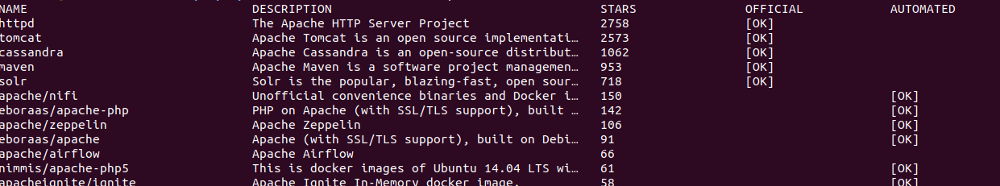
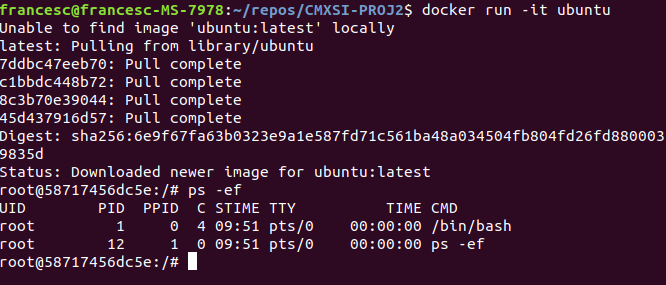
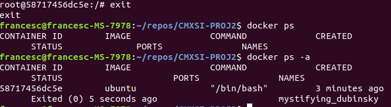
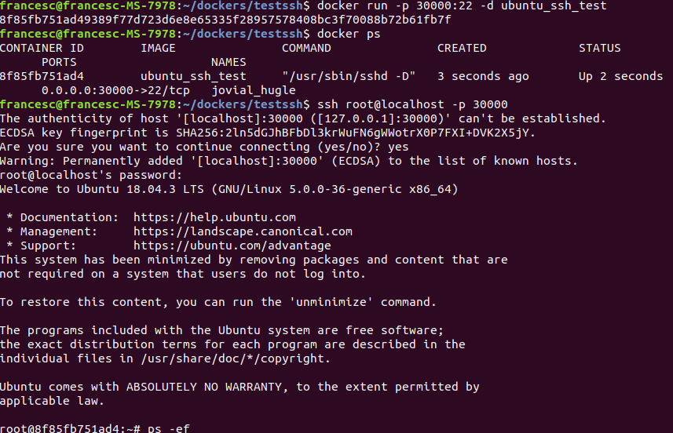
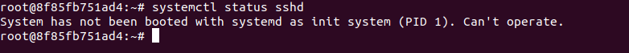
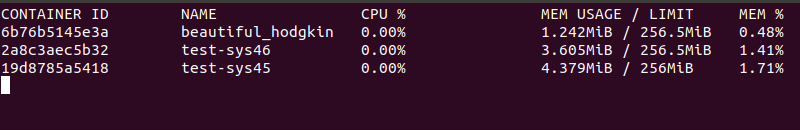
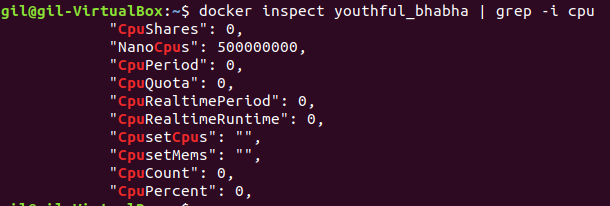
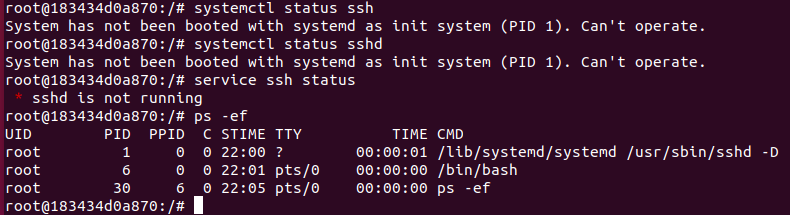
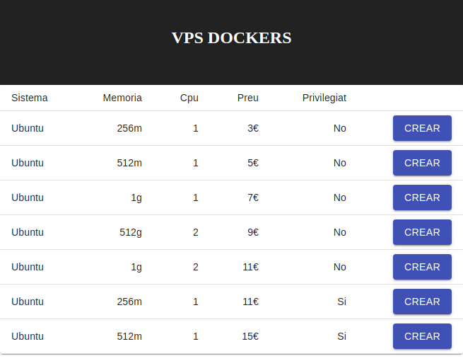
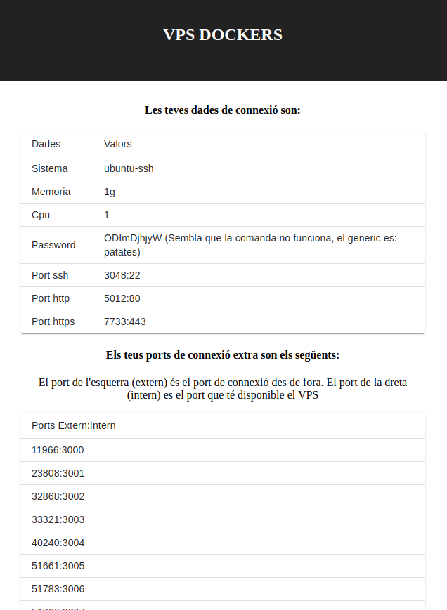

---
title: "Servidors virtuals complets (VPS)"
author: [Francesc Xavier Bullich Parra, GEINF (UDG-EPS)]
date: 27 de Desembre de 2019
subject: "Udg - Eps"
tags: [VPS]
subtitle: "Tutor de la pràctica : Antonio Bueno"
titlepage: true

...

\newpage


# 1. Introducció
Es vol diferenciar l’oferta d’un ISP oferint als clients alguns extres. En aquest cas l’ISP oferirà un servei de
servidors virtualitats privats (VPS) de manera que pugui instal·lar totes les aplicacions que necessiti.

Un VPS és una solució més segura i estable que contractar un hosting compartit. En un VPS s’utilitza una
partició virtual d’un servidor físic al que se li assigna recursos exclusius i en el qual si pot instal·lar un
sistema operatiu que permet treballar amb més llibertat.
Alguns aspectes importants dels VPS son:

- Els problemes de trànsit d’altres usuaris no l’afecten
- S’obté accés de superusuari, per tant s’obté total llibertat dins del VPS
- Es té major privacitat, ja que les bases de dades estan bloquejades a altres usuaris del servidor
- Es pot escalar fàcilment, afegint més ram, cpu, espai de disc o ample de banda)

D’altra banda, al tenir control sobre el sistema VPS, requereix que el client tingui major coneixement tècnic
per administrar el servidor. Aquest punt pot portar a vulnerabilitats de seguretat si no es configura bé.

## 1.1 Plans d’allotjament
En general els proveïdors de VPS ofereixen diferents plans, els quals van escalen en recursos. Aquests
plans estan pensats per oferir recursos segons les necessitats/pressupost dels clients. Trobem els plans
més econòmics que tenen uns recursos més limitats per usuaris que no requereixin gaire potencia ni
emmagatzematge. A l’altre extrem plans que ofereixen els recursos necessaris per suportar una gran
quantitat de demanda (xarxa).

Pot ser que dins d’un mateix pla es pugui escalar una mica, es a dir que es puguin augmentar
lleugerament els recursos pagant el mateix. De forma que no és necessari canviar de pla si en algun
moment és necessiten recursos extres, sempre que no sigui un canvi molt significatiu.

D’altra banda també se sol poder escalar canviant de pla sense que suposi feina extra pel client
(reinstal·lar tot el subsistema en un altre servidor).

## 1.2 Objectiu
L’objectiu és instal·lar i configurar algun paquet que permeti crear i gestionar VPS per tal que el client
pugui tenir el control sobre el seu servidor. En apartats posteriors es veuran alguns programes que poden
servir per la gestió dels VPS.

A més s’haurà d’oferir una plataforma web per tal que el client pugui escollir el pla que millor satisfaci les
serves necessitats. Aquest apartat es farà o be oferint els plans mencionats anteriorment (oferir diferents
recursos de màquina segons el pla triat) o be oferint plantilles de servidors que ja tinguin software pre-
instal·lat com per exemple que ja porti un servidor apache instal·lat o algun altre software que pugui ser
d’interès pel client. La idea és com a mínim que es pugui triar entre diferents sistemes operatius i que un
cop finalitzada la instal·lació, se li doni al client les claus d’accés (usuari, password, ip) per connectar-se al
seu VPS.

També serà necessari un punt d’unió entre el servidor web i la creació o gestió dels VPS. Quan l’usuari trii
una de les opcions que s’ofereixen a la web, hi haurà d’haver algun procés que rebi la petició per tal de: o
bé crear un nou VPS o modificar les propietats d’un dels VPS existents (modificar recursos d’un VPS d’el
client).


## 2. Software de virtualització per els VPS

Es poden utilitzar diferents eines a diferents nivells que permetrien la gestió de VPS.

## 2.1 IaaS (Infrastructure as a Service):
En aquest nivell podem trobar per exemple OpenStack. És una plataforma de cloudComputing per treballar
en núvols públics o privats. Es composa de diferents mòduls que estan separats entre ells però que
interactuen. Entre altres, hi ha mòduls que serveixen per autenticació i d’altres que son només
d’emmagatzematge.

Com és pot intuir OpenStack serviria per gestionar els VPS dels clients però ofereix moltes més coses i
per funcionar requereix un gran esforç inicial per al final només oferir VPS. Per tant, per el tema que
ocupa, no s’utilitzarà aquest software.

## 2.2 Eines de Virtualització completa
En aquest cas ens trobem en l’extrem oposat. Aquestes eines permeten vitalitzar tot el hardware, com
memòria, processador, interfícies de xarxa o disc de forma que el VPS quedi aïllat dels altres. Aquestes
eines permeten instal·lar qualsevol sistema operatiu i a més donar total llibertat al client. Ofereixen
permisos totals sobre el VPS per tant el client podrà instal·lar qualsevol cosa dins, sempre que es
compleixi amb la limitació que ha contractat. En aquest apartat trobem eines com VirtualBox, VMWare o
KVM entre altres.
Qualsevol d’aquestes opcions pot ser vàlida per la gestió dels VPS.

## 2.3 Contenidors
Una opció una mica diferent és utilitzar eines de contenidors per gestionar els VPS. S’ha de tenir en
compte que els contenidors corren en el mateix kernel del sistema amfitrió i per tant estan lligats en certa
manera. Per exemple contenidors muntats sobre un sistema Linux no podrà tenir contenidors Windows ja
que el kernel no és el mateix.

Segons [3] existeixen diferents tipus de contenidors: contenidors d’aplicacions (com Docker) i contenidors
“Full System”. En principi (i segons la major part de blogs i posts) els contenidors d’aplicacions no poden
tenir un sistema operatiu propi sinó que estan pensats per córrer 1 sola aplicació, amb totes les
dependecies que necessiti. Si es vol poder instal·lar sistemes operatius complets dins d’un contenidor
s’han d’utilitzar els de tipus “Full System”.
A la pràctica, Docker per exemple te imatges de ubuntu o centos que, un cop arrancats, se’ls poden
instal·lar més paquets com apache o mysql, poden córrer més d’un servi alhora.

A priori, el que ofereixen els “Full system” és poder córrer contenidors amb un sistema operatiu complet, a
diferencia dels altres contenidors. Alguns software son OpenVz o LXC. D’altra banda tenen la mateixa
limitació que Docker, els contenidors corren tots sobre el kernel del sistema operatiu amfitrió.

Així doncs, els contenidors ofereixen un sistema de fitxers i dependències, aïllats per a cada contenidor,
però que no tenen un kernel propi i per tant depenen del sistema operatiu base.


# 3. Elecció de l’eina de virtualització

Com ja he comentat, descarto eines a nivell de IaaS ja que se’n van una mica del que es necessita per un
VPS. Per tant em quedo entre les eines de virtualització completa o els contenidors full System.

Pel que fa a eines de virtualització completa tenim: VMWare ESXI. Aquesta eina corre sobre un sistema
operatiu propi i manega les maquines virtuals a traves d’ell. D’altra banda tenim VirtualBox o KVM que
corren en sistemes operatius Windows o Linux.

KVM utilitza un kernel basat en Linux per tant només el podem instal·lar sobre un amfitrió Linux.
Pel que fa a VirtualBox potser està més pensat per la virtualització de maquines Desktop però també seria
una opció.

Per comoditat em quedaria o bé amb KVM o Virtualbox ja que els puc instal·lar en qualsevol ordinador que
tingui un Linux o un Windows.

En quant als contenidors tenim els contenidors orientats a aplicacions com Docker o bé contenidors
orientats a “Full System” com LXC o OpenVz. Pel que fa a OpenVz s’ha d’executar en un kernel concret,
per tant de moment el descarto.

Segons la informació que he anat trobant per internet es diu que amb Docker no es poden virtualitat
sistemes operatius, però com he comentat abans he pogut instal·lar una imatge de ubuntu i no he sabut
trobar una diferència significativa per tant diria que tant Docker com LXC poden servir.

Un punt a favor de Docker es que es pot instal·lar en diversos sistemes operatius amfitrions com Windows
a part de Linux. Per contra LXC només funciona sobre Linux i per tant només podríem tenir contenidors de
diferents distribucions Linux. Docker donaria diversitat en quant a sistemes operatius a oferir.

## 3.1 Proves realitzades

LXC i Docker

En el cas de LXC he pogut instal·lar tot el sistema i configurar-lo correctament. Després he pogut crear un
contenidor seleccionant la imatge d’un llistat predefinit de diferents distribucions de Linux. He instal·lat un
ubuntu 18.04.

El procediment és molt senzill i força ràpid. Un cop s’instal·la es pot fer una instrucció per loggar com a
root de la màquina amfitriona i crear els usuaris pels clients, així com instal·lar software addicional.

L’únic inconvenient de moment és que com a root de l’amfitrió es pot accedir a les màquines dels clients.
De moment no he trobat si es pot deshabilitar aquest accés.
Crec que es poder limitar alguns aspectes com la ram o espai de disc però no ho he provat. Si es pogués
fer seria senzill crear el sistema de plans diferents.
He seguit aquesta guia per instal·lar i provar LXC:

https://www.linuxjournal.com/content/everything-you-need-know-about-linux-containers-part-ii-working-
linux-containers-lxc

Per part de Docker, l’he instal·lat sobre un ubuntu 18.04 i dins he estirat una imatge de ubuntu amb un
Dockerfile que instal·la i executa openssh-server.

Un cop dins he pogut instal·lar i engegar un apache2 i un mysql. El problema que hi he trobat és que al
parar el contenidor i tornar-lo a encendre, els serveis apache2 i mysql estaven parats, per contra, com que
la imatge esta muntada perquè executi un openssh d’inici, aquest servei si que estava encès.

S’hauria de veure quin comportament tenen els contenidors entre LXC i Docker.


## 3.2 VM vs Contenidors
Els contenidors, a diferencia de la virtualització completa, no necessita virtualitzar elements com el disc, la
memòria o la CPU. A més com que tots els contenidors utilitzen el mateix kernel del sistema amfitrió per
tant també és mes lleuger que la virtualització completa.

En principi en contenidors també es millora la distribució dels recursos de la màquina base ja que hi ha
molts processos actius en un sistema operatiu complert que no son necessaris en contenidors.

Per tant el sentit comú ens diu que segurament podrem tenir moltes més instancies de contenidors com a
VPS que maquines virtuals completes.

De moment doncs intentaré treballar amb contenidors treballant com a VPS i concretament amb Docker ja
que, si funciona igual que LXC, tinc la possibilitat de poder instal·lar més sistemes operatius apart de
distribucions de Linux.


# 4 Instal·lació de Docker

## 4.1 Ubuntu 18.04

S’instal·larà Docker des del repositori oficial. Per fer-ho s’instalaran primer alguns paquets necessaris.
Primer de tot els paquets que permeten a ‘apt’ utilitzar HTTPS.

    sudo apt install apt-transport-https ca-certificates curl software-properties-common

Després s’afegeix la clau GPG per el repositori de Docker.

    curl -fsSL https://download.docker.com/linux/ubuntu/gpg | sudo apt-key add -

Afegim el repositori de Docker a les fonts ‘apt’

    sudo add-apt-repository "deb [arch=amd64] https://download.docker.com/linux/ubuntu bionic stable"

I finalment s’actualitza la base de dades de paquets

    sudo apt update

Ara ja es pot instal·lar Docker a ubuntu.

    sudo apt install docker-ce

Només els usuaris amb privilegis poden utilitzar comandes de Docker. En concret només els usuaris
‘sudoers’ o bé els del grup ‘docker’. Podem afegir tots els usuaris necessaris al grup ‘docker’. Utilitzar
usuaris del grup ‘docker’ permet no haver de posar sudo davant totes les instruccions.
Es possible que després d’afegir un usuari al grup, sigui necessari iniciar sessió de nou per a que
s’apliquin els canvis.

    sudo usermod -aG docker <username>;


# 5. Creació d'un docker per VPS

Per crear un contenidor necessitem sempre crear-lo des d'una imatge base que conté tot el necessari perque el contenidor funcioni correctament.

Docker disposa d'una serie d'imatges oficials predefinides.  Per veure les imatges disponibles hi ha la comanda 'search'. Per exemple si volem veure totes les imatges relacionades amb apache fem:

    docker search apache
    


A part de serveis, també podem trobar imatges de diferents sistemes operatius. Com ja s'ha comentat s'ha d'anar en compte ja que els conenidors utilitzaran el mateix kernel que la màquina host, per tant podem trobar sistemes incompatibles.

Docker té versió tant de windows com de linux per tant podriem tenir contenidors amb els 2 sistemes, sempre que estiguin al host adequat.

## 5.1 Instal·lació d'un ubuntu mínim

Per fer el treball em centrarè en contenidors amb ubuntu, peró podria ser qualsevol sistema linux. 

La creació i posada en marxa d'un contenidor és molt simple. Ens fan falta les seguents comandes:

- __docker create 'imatge'__: Crea el contenidor amb la imatge seleccionada. Primer consulta les imatges locals, i si no te la 'imatge' intenta buscarla al repositori de Docker i la descarrega en local.

- __docker start 'nom contenidor'__: Un cop creada la imatge s'ha de posar en marxa amb aquesta comanda. Quan es crea el contenidor se li pot posar un nom amb el parametre __--name__. Si no l'hi hem posat nom docker n'hi posara un d'aleatori.

- __docker ps [-a]__: Ens mostra la informació bàsica de tots els contenidors encesos. Amb aquesta comanda podem veure el nom dels contenidors, si no els hi hem assignat. El paràmetre -a mostra tots els contenidors disponibles, engegats o parats.

- __docker run [-it] 'imatge'__: Aquesta comanda es la conjunció del __docker create__ i __docker start__. Si posem el paràmetre -it, entrarem al shell del contenidor.

Nota: En principi totes les comandes haurien de funcionar correctament pero en alguns casos, el docker create + start no m'ha funcionat amb ubuntu per tant utilitzo el docker run

Per veure totes les opcions disponibles de docker run veure [4]

Exemple creació de contenidor ubuntu:



Com es pot observar, ara la consola que es mostra és la del contenidor ubuntu i podem que només hi ha el proces del shell actiu.

Si fem exit el contenidor es pararà pero seguira existint. Si fem docker ps -a el podrem veure.




## 5.2 Contenidor ubuntu amb requeriments minims per servei VPS

En l'apartat anterior hem vist com crear un contenidor amb un sistema ubuntu. Si seguim aquells passos, només podrem accedir al docker de forma local. A part l'unic proces actiu al engegar el docker era el propi shell per tant, de cares a un VPS ens serveix de poc tal com està.

El primer pas seria instal·lar un servidor ssh perque el client del ISP pugui connectar-se a la seva "màquina virtual". Això es podria fer un cop accedim al shell del nou contenidor, però no seria gens automatitzable.

El que és més recomenable és fer que el contenidor ja tingui tot el que necessita un cop s'engega. D'aquesta manera, al rebre la petició del client, nomes caldrà crear i engegar el contenidor. El podrà connectar-se sense implicació del ISP.

El que se sol fer, es preparar imatges custom on, apart del sistema operatiu, indicarem tots els paquets necessaris que ha de tenir un contenidor.

Quan es crei un nou contenidor a partir d'aquestes imatges, ja disposarà de tot el necessari de forma automàtica. 

### 5.2.1 Creació d'una nova imatge amb Dockerfile

Per crear imatges custom necessitem crear un fitxer Dockerfile que contindrà totes les instruccions que s'hauran de realitzar al constuir la imatge. El fitxer Dockerfile funciona de forma similar a un makefile per compilar un programa.

Exemple de Dockerfile per a instal·lació de openssh:

    FROM ubuntu:18.04

    RUN apt-get update && apt-get install -y openssh-server
    RUN echo 'root:patates' | chpasswd
    RUN sed -ie '0,/#PermitRootLogin prohibit-password/s/#PermitRootLogin prohibit-password/PermitRootLogin yes/' /etc/ssh/sshd_config

    # SSH login fix. Otherwise user is kicked off after login
    RUN sed 's@session\s*required\s*pam_loginuid.so@session optional pam_loginuid.so@g' -i /etc/pam.d/sshd

    ENV NOTVISIBLE "in users profile"
    RUN echo "export VISIBLE=now" >> /etc/profile

    EXPOSE 22
    CMD ["/usr/sbin/sshd", "-D"]


- __FROM__: A la linia From indiquem de quines imatges inicials volem partir. En aquests cas des d'una imatge de ubuntu. El format és [nom_imatge]:[versió/tag]
- __RUN__: Amb les comandes run podem executar comandes del sistema operatiu base per crear directoris o instal·lar paquets. En aquest cas s'instal·la un openss-server i es prepara perque l'usuari root pugui tenir acces.
- __ENV__: Es poden definir variables d'entorn que el contenidor tindrà disponibles un cop s'engegi.
- __EXPOSE__: Aquesta comanda enspermet tenir ports habilitats dins del contenidor. En aquest cas habilitem el port 22 ja que haurem de connectar per ssh
- __CMD__: Es la comanda que executarà el contenidor al iniciar-se.

Només podem tenir una linia CMD per tant, tot i que tenim un sistema operatiu i podem tenir més d'un servei actiu, d'inici només podem inciar una comanda.

 Docker està pensat per tenir serveis únics amb el mínim necessari per funcionar. Per això no te sentit fer que els contenidors executin d'inici més d'una aplicació. Això ens afectarà posteriorment quant necessitem aixecar més serveis dins del contenidor.


Un cop s'ha definit el Dockerfile amb totes les instruccions necessaries, s'ha de crear la nova imatge.

    docker build -t <nom_imatge> .

Com que podem tenir diferents Dockerfiles per crear diferents imatges, s'ha d'indicar el path del fitxer. En aquest cas és el directori actual.
Al fer el 'build' al paht seleccionat, Docker buscarà dins d'aquest directori el fitxer anomenat Dockerfile i l'executarà.

Un cop s'ha creat la nova imatge podem veure-la amb la comanda:

    docker images

Aquesta comanda llista totes les imatges locals que tenim. Com que hem utilitzat la imatge base 'ubuntu:18.04' aquesta també la tindrem, ja que l'ha descarregat per montar la nova imatge.


### 5.2.2 Iniciar contenidor amb la nova imatge ssh

S'utilitzarà la nova imatge per a crear un nou contenidor que tingui el servei de ssh engegat. Fem servir la comanda docker run per crar el nou contenidor i posar-lo en marxa.

    docker run -d -p 30000:22 <nom_imatge>

Com es pot veure és necessari fer la relació de ports de la màquina real al contenidor. Si no ho fessim no podriem accedir al contenidor per ssh. Tot i que utilitzi el port 22 com hem vist abans, el contenidor no té @IP per tant ens hem de dirigir a ell des de la màquina real. 

De moment no he trobat cap manera de reassignar ports o obrir-ne de nous un cop el contenidor està creat. Es possible que és pugui, però per el moment l'única manera és parant el contenidor i crear-ne un de nou a partir de l'actual, assignant tots els ports necessaris amb el parametre -p.

Amb el paràmetre -d indiquem que el conenidor s'iniciará en mode 'detached' és a dir que no estarà connectat a la consola, o bé que correrà en background. Això és important ja que si no ho fem, el cicle de vida del contenidor estarà lligat al terminal.

Un cop s'ha encés el contenidor podem accedir a ell via ssh.



Si mirem quins processos hi ha actius veurem que només hi a la consola i el servei de ssh.

Un cop dins del servidor, el client podria instal·lar qualsevol paquet que volgues. L'inconvenient és que si necessita accés al exterior s'haurà d'indicar abans de crear el contenidor.

Un problema més gran és en relació al proces que ha iniciat el contenidor. Si no especifiquem res més no tindrem acces al systemctl i per tant no podrem aixecar nous servies.




El que si que es permet és realitzar crides 'service' pero no se quins inconvenients poden arribar a sorgir si no s'inicia el sistema amb proces initd.


## 5.3 Limitiació de hardware

Quan mirem els diferents proveidors de VPS veiem que una de les coses que ofereixen és triar el hardware que es contractarà. Ja sigui de forma senzilla, triant algun de les plantilles predefinides amb un hardware fix, o bé seleccionant el hardware amb diferents mesures preestavlertes per el proveidor.

Docker permet limitar de forma similar els recursos que pot utilitzar un servidor. En principi també és pot gestionar de forma dinàmica pero en aquesta pràctica només es tractarà de forma fixe, sense canvis.

En concret limitarem la mida de la memoria i cpu que pot tenir cada contenidor. Crec que existeix també alguna forma de limitar l'espai de disc peró de moment no he aconseguit fer-ho funcionar.


### 5.3.1 Memòria

Hi ha diverses opcions relacionades amb la limitació de memòria (veure [5]). En aquest cas farem un limit simple i fix.

El paràmetre que s'ha d'utilitzar en aquest cas és el -m o --memory. Només cal indicar la mida assignada en mb o gb.

El nombre mínim de memoria és 4Mb i el màxim depen de la mida de la memoria de la màquina real. Tot i que si posem més memoria, docker no es queixa pero acaba posant el màxim de memoria que te la màquina i no el nombre indicat.


    docker run -it -d --memory="256m" ubuntu

Podem utilitzar la comanda 'stats' per veure que realment el nou contenidor té la memória limitada a aquesta mida.

    docker stats



Com es pot observar no ocupen gaires recursos ja que cada contenidor només te els pocs elements necessaris per funcionar.


__Requeriments__

Es possible que en alguns entorns sigui necessari algunes configuracions previes abans de poder limitar els recursos dels dockers.

Per poder executar correctament la comanda de docker que limita le memoria, s'ha de modificar el fitxer de configuració del host: __/etc/default/grub__. 
Un cop modificat s'ha de fer un update del grub i reiniciar la màquina.

En concret s'ha de posar aquesta línia:

    GRUB_CMDLINE_LINUX="cgroup_enable=memory swapaccount=1"

</line>

    sudo nano /etc/default/grub
    sudo update-grub
    sudo reboot

### 5.3.2 CPU

Com en el cas anterior, hi ha diverses opcions en quant a limitació de CPU. Em quedaré amb el cas més senzill de limitació fixe pero es poden veure les altres a [5].

S'utilitza el parametre --cpus. En aquest cas no s'indica directament una mida o frequencia de treball sino que s'indica un valor decimal. Aquest valor farà referència a la fracció de nombre de cpus de la màquina host.

L'interval de valors permesos és de 0.01 fins al nombre de cpus reals de la màquina host. En aquest cas, si superem aquest nombre, docker si que es queixa avisant-nos de la mida màxima i no continua amb la creació del contenidor.

    docker run -it -d --cpus=0.5 ubuntu

En aquest cas amb multiplicador de 0.5, estem assignant l'equivalent a mitja cpu de les que tenim reals.

La comanda 'stats' no ens informa de la mida de la cpu triada pero podem buscar-la d'una altra forma.

    docker inspect <nom docker> | grep -i cpu

Amb docker inspect trobem tota la informació del conenidor en format json.



Com es pot observar hi ha diversos atributs relacionats amb la cpu que es poden modificar, en aquest cas l'atribut afectat és el NanoCpus. Si canviem el valor del paràmetre al crear el contenidor podrem veure com aquest valor canvia.


## 5.4 Inici amb systemd

Com s'ha comentat anteriorment, no totes les comandes estan disponibles iniciant el conenidor per exemple amb ssh. Per tenir disponible el systemctl, entre altres, necessitem que el contenidor inicii amb el proces systemd o initd.

S'haurà de modificar el Dockerfile i la imatge original. En comptes d'utilitzar la imatge bàsica de ubuntu n'utilitzarem una personalitzada que inclou l'inici amb systemd. Concretament __jrei/systemd-ubuntu__.

D'altra banda hem de fer que la comanda que inicial sigui el systemd. Necesitem però que el servei ssh s'inicii si o si ja que sino el client no podria connecatrse al seu VPS.

Per tant el que es fa és conservar la comanda 'CMD' que executava el servei ssh. En canvi afegirem un 'ENTRYPOINT' per systemd. Un 'ENTRYPOINT' vindria a ser la comanda principal que executarà el contenidor, posteriorment s'executarà la comanda 'CMD'.

    FROM jrei/systemd-ubuntu

    RUN apt-get update && apt-get install -y openssh-server
    RUN mkdir /var/run/sshd
    RUN echo 'root:patates' | chpasswd
    RUN sed -ie '0,/#PermitRootLogin prohibit-password/s/#PermitRootLogin prohibit-password/PermitRootLogin yes/' /etc/ssh/sshd_config

    # SSH login fix. Otherwise user is kicked off after login
    RUN sed 's@session\s*required\s*pam_loginuid.so@session optional pam_loginuid.so@g' -i /etc/pam.d/sshd

    ENV NOTVISIBLE "in users profile"
    RUN echo "export VISIBLE=now" >> /etc/profile

    EXPOSE 22
    EXPOSE 80
    ENTRYPOINT ["/lib/systemd/systemd"]
    CMD ["/usr/sbin/sshd", "-D"]


Si fem una imatge amb el nou Dockerfile i arranquem un contenidor veurem que, tot hi haver 'executat' el servei ssh no podem connectar per aquesta via.

Podem executar la consola de bash per veure que està passant al contenidor.

    docker exec -it <nom_contenidor> /bin/bash

Si es comprova el systemctl veurem que no funciona tot hi haver iniciat amb systemd. També es pot observar que el servei ssh no està iniciat.



La configuració del Dockerfile és correcta i el contenidor s'ha iniciat amb el systemd. LLavors que és el que està fallant?.

Resulta que Docker executa els contenidors amb certes capabilities desactivades. Això fa que no pugui accedir a totes les funcions del kernel host.

Per a poder executar correctament aquest contenidor amb totes les comandes disponibles s'ha de fer amb el que s'anomena mode privilegiat __--privileged__.
A més hem de montar la carpeda dels grups de control (cgroups) perque tot funcioni correctament. Ho fem amb opció de ReadOnly.

    docker run -d --privileged -v /sys/fs/cgroup:/sys/fs/cgroup:ro <nom_imatge>

Si executem el docker d'aquesta manera, ara s'haurà iniciat el contenidor amb systemd i tindrem el servei ssh actiu.

__IMPORTANT__

Iniciar un docker de forma privilegiada amb --privileged dona acces total al kernel host. Fins i tot és possible arribar a modificar fitxers del sistema host des de dins del contenidor.

Aquesta opció és bastant perillosa en quant a seguretat i integritat del sistema per tant es recomana no donar el mode privilegiat als contenidors.

Per contra s'haurien d'afegir només les capabilities necessaries. Això es pot fer amb el paràmetre __--cap-add__ 
quan es crea el contenidor.


## 5.5 Altres funcionalitats

Ara ja hauriem de tenir un docker amb ssh, s'hagi obtat per tenir un contenidor privilegiat amb systemcl o no.

Recordem que els contenidors docker només tenen el mínim necessari per funcionar per tant, tots aquells processos no especificats alhora de crear la imatge no estaran disponibles.

Això també afecta al syslog. Per defecte no tindrem syslog. Com que és interessant tenir-lo el podem afegir quan creem la imatge amb el fitxer DockerFile. Això valdria per qualsevol paquet que necessitem.

Per tenir syslog només hem d'afegir la linia d'instal·lació al __[Dockerfile](https://github.com/fxbp/CMXSI-PROJ2/blob/master/Dockerfile)__.

    RUN apt-get -y install rsyslog


# 6 Plataforma VPS

Per automatitzar el proces de creació de servidors privats virtuals (VPS) he creat un parell d'aplicacions. Un webservice que està connectat amb la plataforma Docker i una apliació web que permet que l'usuari creii els seus servidors virtuals.

Els contenidors tindran limitacions de memoria i cpu fixes. A part un cop 'bindejats' els ports, no es poden canviar sense apagar el docker i crear-ne un de nou.

No he mirat quines eines hi ha per fer aquestes funcionalitats. Una opció però seria crear imatges a partir dels contenidors actuals (per conservar tot el que el client hagi pogut guardar o instal·lar dins el contenidor) i generar nous contenidors amb les imatges noves.

## 6.1 Webservice

El servei web gestiona les peticions que fa el client web. Aquest servei es comunica amb el daemon de docker per tal de crear i engegar els dockers que demanen els clients.

Es un webservice molt simple fet amb Java i Spring Boot. En aquest cas només s'ocupa d'atendre la crida per crar un VPS des del client web, però per fer-ho be també hauria de gestionar l'autenticació del client i verificar quines accions pot fer.

El projecte est dins el directori DockerService. També es pot trobar a __[Projecte Spring VPS](https://github.com/fxbp/CMXSI-PROJ2/tree/master/DockerService)__.


Per estalivar feina he reutulitzt codi que ja tenia d'un altre projecte. El que fa el webservice, un cop rep la petició, és executar un 'runnable' directe contra el bash d'ubuntu. Per tant és necessari que el servei web s'axiequi amb un usuari que pugui realizar crides de docker, amb un usuari que pertanyi al grup docker.

Buscant vies alternatives, també existeix una API de Docker que permet la gestió de tot l'entorn, imatges, contenidors, volumns, xarxes, etc. No hi he entrat però a la llarga semblaria una via millor i més escalable que les crides a bash. La API canvia molt sobint per tant s'ha de vigilar amb la versió. Podem trobar la documentació de la 1.24 a [6].

## 6.2 Client web

He fet un petit client web que permet escollir diferents configuracions de VPS. Es mol senzill i serveix només a mode de demostració. El client està fet amb react (javascript). El codi es pot trovar dins dle directori vps-docker o també a __[Projecte react VPS](https://github.com/fxbp/CMXSI-PROJ2/tree/master/vps-docker)__

El client ofereix un llistat de serveix prefixats. Un cop se n'escull un es fa una petició al servidor web que crearà el docker corresponent. Finalment es mostren les dades necessaries per connectar amb el VPS. Dins la informació rellevant hi ha un seguit d'assignacions de ports entre la maquina real i el docker per tal que el client pugui utilitzar ports cap a l'exterior del docker. Els ports ssh, http i https estan ja especificats.







## 6.3 Seguretat

Com ja he explicat anteriorment el servidor web s'ha d'executar amb un 
usuari del grup docker. Aquest usuari no cal que sigui root i per tant també tanquem la porta a possibles atacs per aquesta via.

### 6.3.1 Contrasenya ssh

També és important la seguretat dins dels dockers. Com ja s'ha explicat, a tots els docker VPS se'ls instala openssh per tal que el client pugui accedir a ells un cop iniciats. 

El problema del docker es que la contrasenya per ssh del root es crea dins la imatge, per tant tots els contenidors que utilitzin aquella imatge tindran la mateixa contrasenya.

La idea aqui és generar una contrasenya aleatoria cada cop que es crea un nou docker i canviar-li al root. Aquesta contrasenya també l'hauria de canviar el client un cop accedeixi. No està fet pero al iniciar l'ubuntu es pot demanar un canvi de contrasenya obligatori.


Des del servidor web s'intenta canviar la contrasenya pero per culpa de les redireccions de sortida que fan els runnables dins del codi, no es poden fer pipes (|) a les instruccions. Com a resultat la contrasenya no es canvia. He provat alguna altre solucio simple pero sembla que no funcióna. S'hauria d'invertir més temps en aquest apartat per veure quina seria la solució optima, potser canviant a la API es pot solucionar facilment.


### 6.3.2 CORS

Aquest es un punt feble de l'aplicació. En desenvolupament el client web i el servidor web son el matiex. Aixó fa que salti un error per el CORS (cross origin resource sharing). Per evitar-ho he hagut d'afegir una configuració al servidor web per tal que deixi passar aquest tipus de connexió. 

Per anar bé s'hauria de treure.


# 7 Conslusions

Tot i que docker permet crear un contenidor a partir només d'una imatge de sistema operatiu, i per tant utilitzar-los com a VPS, personalment no recomano utilitzar-los així.

Docker està pensat per tenir microserveis, es a dir, que en un contenidor hi corri només el necesari per fer funcionar una aplicació.

Com he anat explicant, els contenidors tenen només els paquets necessaris i que explicitament s'han instal·lat en les imatges. Això fa que el sistema operatiu que es pugui crear li faltin moltes cosses esencials com a sistema.

La utilització d'un sol kernel i que no es necessiti virtualitzar hardware, fa que crear i axiecar un contenidor sigui molt simple i rapid, però per fer certes coses necessitem un acces privilegiat al kernel que molts cops no és una bona opció.

Docker en principi te ben aillats els diferents contenidors pero al compartir kernel i el fet que es montin carpetes del so host com a volumns fa que, mal configurat, pugui comportar un risc de seguretat.

Una alternativa per tenir diferents serveis enllacats corrent a docker és utilitzar docker-compose [7].  

Amb docker-compose podem fer les mateixes accions que amb el docker run: crear i assignar volums, bindejar ports, assignar adreces de xarxa fixes, etc. Dins del mateix fitxer compose es poden declarar diferents contenidors. Aquest contenidors poden dependre d'altres del mateix fitxer i no engegar-se fins que els primers estiguin llestos.

Per exemple si necessitem un apache que tingui connexio a una base de dades, podem tenir 2 contenidors: 1 per l'apache i l'altre que nomes faci de BDD. 


\newpage

# Referències

[1] [Que és un VPS](https://www.hostinger.es/tutoriales/que-es-un-vps)

[2] [Virtualització amb contenidors](https://www.ionos.es/digitalguide/servidores/know-how/alternativas-a-los-contenedores-en-docker/)

[3] [LXC vs KVM](https://www.skysilk.com/blog/2019/lxc-vs-kvm/)

[4] [Documentació docker run](https://docs.docker.com/engine/reference/run/)

[5] [Limitació memoria i cpu docker](https://docs.docker.com/config/containers/resource_constraints/)


[6] [API Docker](https://docs.docker.com/engine/api/v1.24/)


[7] [Docker compose](https://docs.docker.com/compose/)


```
Ubuntu
pandoc README.md -o README.pdf --from markdown --template eisvogel --listings --toc


Windows

pandoc README.md -o README.pdf --from markdown --template eisvogel --listings --toc --pdf-engine=xelatex
```